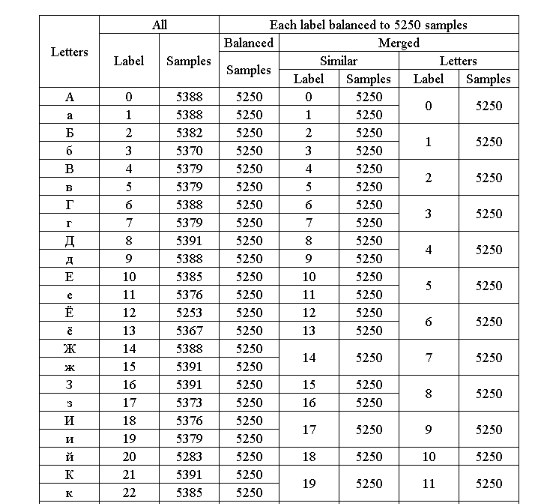

# MNIST like dataset  handwritten Mongolian Cyrillic characters

Handwritten Mongolian Cyrillic Characters (HMCC) dataset нь 28 x 28 хэмжээтэй саарал өнгийн шошготой Монгол кирилл үсэг нь муруй болон хуурамч хэв маягтай бөгөөд MNIST болон EMNIST мэдээллийн санг дуурайх хэлбэрээр бүтээгдсэн.

Монгол кирилл үсэг нь 35 тэмдэгтээс бүрдэнэ.

Өө ⟨ö⟩ болон Үү ⟨ü⟩ гэсэн хоёр нэмэлт тэмдэгтээс бусад нь орос цагаан толгойтой адилхан. HMCC өгөгдлийн сан нь 62 ангийн том, жижиг үсгийн зургийг агуулдаг ба зөвхөн Й, Ъ, Ы, Ь үсгүүдийн жижиг үсгийн зургуудыг агуулдаг бөгөөд эдгээр 4 үсэг нь хэзээ ч үгийн эхний үсэг болдоггүй. Тиймээс өгөгдлийн сан нь хамгийн ихдээ 66 ангитай.

`HMCC` database нь өөр өөр class, samples бүхий 4 dataset - ээс бүрдэнэ.

`HMCC all:` It contains 367116 samples of all 66 classes.

`HMCC balanced:` It contains 345500 samples of all 66 classes. Each class equally balanced to 5250 samples.

`HMCC similar:` It contains 257250 samples of 49 classes.

Нэгтгэсэн ижил том жижиг үсэг (Ж-ж, И-и, К-к, Л-л , М-м , О-о , С-с , Ү-ү , Ф-ф , Х-х , Ц-ц , Ш-ш , Щ-щ , Э-э , Ю-ю , Я-я) том жижиг түүврийн тоо тэнцүү байна.

HMCC letters: It contains 183750 samples of 35 classes. Merged all uppercase and lowercase characters with equal number of both uppercase and lowercase samples.
There are no test sets created.

There are no test sets created.
For detailed information check below HMCC database structure table.

